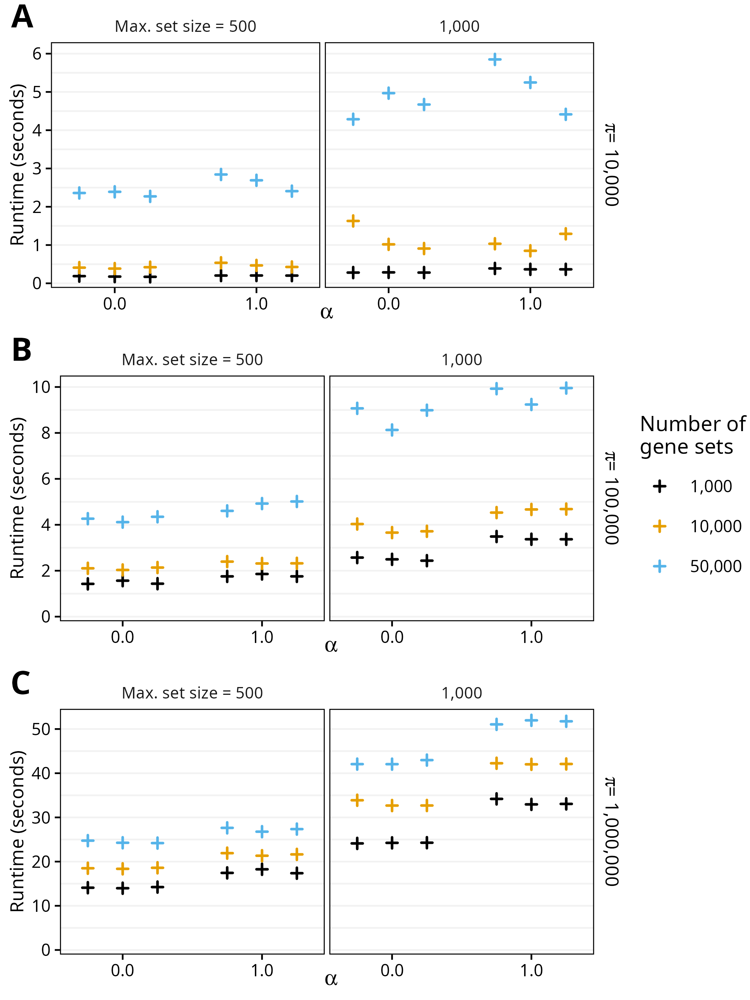

```{r include=FALSE}
knitr::opts_chunk$set(
  fig.align = "center",
  fig.height = 5.55,
  fig.width = 7.8,
  dpi = 300
)
```

# fast.ssgsea

<!-- badges: start -->
[](https://github.com/pnnl/fast.ssgsea/actions/workflows/R-CMD-check.yaml)
<!-- badges: end -->

`fast.ssgsea` is an R package [@R-core-team] for fast gene permutation Gene Set Enrichment Analysis (GSEA) and Post-Translational Modification Signature Enrichment Analysis (PTM-SEA) [@subramanian-gene-2005; @krug-curated-2019].

**NOTE:** Support for directional databases, such as PTMsigDB, is broken starting with version 0.1.0.9018. Until this is fixed, PTM-SEA is not supported.

The primary function, `fast_ssgsea`, accepts a numeric matrix with genes or other molecules as rows and either samples, contrasts, or some other meaningful representation of the data as columns. A named list of gene sets (more generally, molecular signatures) is also required. Other arguments control the behavior of GSEA/PTM-SEA, and they are described in the function documentation.

The package also contains a `read_gmt` function, which reads a Gene Matrix Transposed (GMT) file to construct a named list of gene sets for use with `fast_ssgsea`.


## Installation

R version 4.0.0 or greater is required to install `fast.ssgsea`. 

It may be possible to get `fast.ssgsea` to work with older versions of R by cloning the repository, changing the minimum R version in the DESCRIPTION (e.g., to `>= 3.6.0`), and rebuilding the package, but users should do so at their own risk.

### macOS

A macOS binary is provided in the [latest release](https://github.com/pnnl/fast.ssgsea/releases). Users looking to build and install the development version of `fast.ssgsea` must have the Xcode developer tools from Apple and a FORTRAN compiler installed. See https://mac.r-project.org/tools/ for instructions.

### Windows

No Windows binary is available, so [Rtools](https://cran.r-project.org/bin/windows/Rtools/) must be installed to compile C++ code.

### Install

The development version of `fast.ssgsea` can be installed with

``` r
# install.packages("pak")
pak::pak("pnnl/fast.ssgsea")
```

## Usage

### Simulate Data

We will simulate a matrix with 10,000 genes as rows and one column. Then, we generate 20,000 gene sets by randomly sampling between 5 and 1,000 genes.

```{r simulate-data}
n_genes <- 10000L # number of genes
n_samples <- 1L # number of samples (>= 1)
genes <- paste0("gene", seq_len(n_genes))
samples <- paste0("sample", seq_len(n_samples))

## Simulate matrix of sample gene expression values
set.seed(9001L)
X <- matrix(
  data = rnorm(n = n_genes * n_samples),
  nrow = n_genes,
  ncol = n_samples,
  dimnames = list(genes, samples)
)

## Simulate list of gene sets
n_sets <- 20000L # number of gene sets
min_size <- 5L # size of smallest gene set
max_size <- 1000L # size of largest gene set

size_range <- max_size - min_size + 1L
n_reps <- ceiling(n_sets / size_range)
set_sizes <- rep(max_size:min_size, times = n_reps)[seq_len(n_sets)]

gene_sets <- lapply(seq_len(n_sets), function(i) {
  set.seed(i)
  sample(x = genes, size = set_sizes[i])
})
names(gene_sets) <- paste0("set", seq_along(gene_sets))
```

### Runtime and Results

This shows the runtime of `fast_ssgsea` running on an AMD Ryzen 5 7600X CPU with a clock speed of 4.7 GHz. A total of 10,000 permutations were used to calculate p-values and normalized enrichment scores (NES).

```{r time-results}
library(fast.ssgsea)

# Runtime (elapsed time)
system.time({
  res <- fast_ssgsea(
    X = X,
    gene_sets = gene_sets,
    alpha = 1,
    nperm = 10000L, # default is 1000
    min_size = min_size,
    seed = 0L
  )
})

str(res)
```

### Session Information

```{r session-info}
print(sessionInfo(), locale = FALSE, tzone = FALSE)
```


## Performance

The `fast.ssgsea` R package utilizes linear algebra and ideas from Fast Gene Set Enrichment Analysis [@korotkevich-fast-2021] to greatly reduce the runtime.

Tests were performed on a desktop computer with an AMD Ryzen 5 7600X CPU (6 cores, 12 threads) at 4.7 GHz. Different combinations of the number of gene sets, maximum gene set size, number of permutations, and value of the $\alpha$ parameter (the weighting exponent) were tested in a random order (3 replicates each) to minimize the influence of previous runs.

```{r, echo=FALSE}
fig_cap <- "Runtime of fast_ssgsea with A) 10,000, B) 100,000, or C) 1,000,000 permutations."
```

```{r, echo=FALSE, fig.cap=fig_cap}

```

## References
