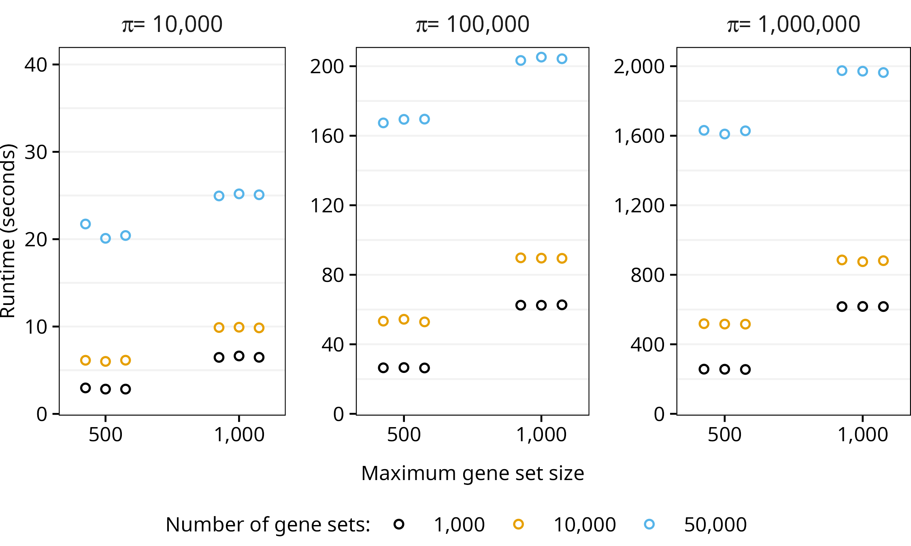

- [fast.ssgsea](#fastssgsea)
  - [Installation](#installation)
    - [macOS](#macos)
    - [Windows](#windows)
    - [Install](#install)
  - [Usage](#usage)
    - [Simulate Data](#simulate-data)
    - [Runtime and Results](#runtime-and-results)
    - [Session Information](#session-information)
  - [Performance](#performance)
  - [Switching the BLAS Library](#switching-the-blas-library)
    - [Linux](#linux)
    - [macOS](#macos-1)
    - [Windows](#windows-1)
  - [Further Improvements](#further-improvements)
  - [References](#references)

# fast.ssgsea

<!-- badges: start -->

[](https://github.com/pnnl/fast.ssgsea/actions/workflows/R-CMD-check.yaml)
[](https://doi.org/10.5281/zenodo.16783102)
<!-- badges: end -->

`fast.ssgsea` is an R package ([R Core Team 2024](#ref-R-core-team)) for
fast Single-Sample Gene Set Enrichment Analysis (ssGSEA) and
Post-Translational Modification Signature Enrichment Analysis (PTM-SEA)
([Barbie et al. 2009](#ref-barbie-systematic-2009); [Krug et al.
2019](#ref-krug-curated-2019)).

The primary function, `fast_ssgsea`, accepts a numeric matrix with genes
or other molecules as rows and either samples, contrasts, or some other
meaningful representation of the data as columns. A named list of gene
sets (more generally, molecular signatures) is also required. Other
arguments control the behavior of ssGSEA/PTM-SEA, and they are described
in the function documentation.

The package also contains a `read_gmt` function, which reads a Gene
Matrix Transposed (GMT) file to construct a named list of gene sets for
use with `fast_ssgsea`.

## Installation

R version 4.0.0 or greater is required to install `fast.ssgsea`.

It may be possible to get `fast.ssgsea` to work with older versions of R
by cloning the repository, changing the minimum R version in the
DESCRIPTION (e.g., to `>= 3.6.0`), and rebuilding the package, but users
should do so at their own risk.

### macOS

A macOS binary is provided in the [latest
release](https://github.com/pnnl/fast.ssgsea/releases). Users looking to
build and install the development version of `fast.ssgsea` must have the
Xcode developer tools from Apple and a FORTRAN compiler installed. See
<https://mac.r-project.org/tools/> for instructions.

### Windows

No Windows binary is available, so
[Rtools](https://cran.r-project.org/bin/windows/Rtools/) must be
installed to compile C++ code.

### Install

The development version of `fast.ssgsea` can be installed with

``` r
# install.packages("pak")
pak::pak("pnnl/fast.ssgsea")
```

## Usage

### Simulate Data

We will simulate a matrix with 10,000 genes as rows and 100 samples as
columns. Then, we generate 20,000 gene sets by randomly sampling between
10 and 500 genes from the matrix row names.

``` r
n_genes <- 10000L # number of genes
n_samples <- 100L # number of samples
genes <- paste0("gene", seq_len(n_genes))
samples <- paste0("sample", seq_len(n_samples))

## Simulate matrix of sample gene expression values
set.seed(9001L)
X <- matrix(
  data = rnorm(n = n_genes * n_samples),
  nrow = n_genes,
  ncol = n_samples,
  dimnames = list(genes, samples)
)

## Simulate list of gene sets
n_sets <- 20000L # number of gene sets
min_size <- 10L # size of smallest gene set
max_size <- 500L # size of largest gene set

size_range <- max_size - min_size + 1L
n_reps <- ceiling(n_sets / size_range)
set_sizes <- rep(max_size:min_size, times = n_reps)[seq_len(n_sets)]

gene_sets <- lapply(seq_len(n_sets), function(i) {
  set.seed(i)
  sample(x = genes, size = set_sizes[i])
})
names(gene_sets) <- paste0("set", seq_along(gene_sets))
```

### Runtime and Results

This shows the runtime of `fast_ssgsea` with the reference Basic Linear
Algebra Subprograms (BLAS) library ([Lawson et al. 1979](#ref-blas))
(single-threaded) running on an AMD Ryzen 5 7600X CPU with a clock speed
of 4.7 GHz.

``` r
library(fast.ssgsea)

# Runtime (elapsed time)
system.time({
  res <- fast_ssgsea(
    X = X,
    gene_sets = gene_sets,
    alpha = 1,
    nperm = 1000L,
    batch_size = 1000L,
    adjust_globally = FALSE,
    min_size = min_size,
    sort = TRUE,
    seed = 0L
  )
})
```

    ##    user  system elapsed 
    ##  42.945   0.472  37.272

``` r
str(res)
```

    ## 'data.frame':    2000000 obs. of  9 variables:
    ##  $ sample      : Factor w/ 100 levels "sample1","sample2",..: 1 1 1 1 1 1 1 1 1 1 ...
    ##  $ set         : chr  "set3049" "set2620" "set8425" "set16760" ...
    ##  $ set_size    : int  398 336 423 435 391 301 301 458 440 454 ...
    ##  $ ES          : num  948 968 870 842 848 ...
    ##  $ NES         : num  4.41 4.09 4.13 4.14 3.89 ...
    ##  $ n_same_sign : int  543 539 539 537 536 535 535 533 533 530 ...
    ##  $ n_as_extreme: int  0 0 0 0 0 0 0 0 0 0 ...
    ##  $ p_value     : num  0.00184 0.00185 0.00185 0.00186 0.00186 ...
    ##  $ adj_p_value : num  0.796 0.796 0.796 0.796 0.796 ...

### Session Information

``` r
print(sessionInfo(), locale = FALSE, tzone = FALSE)
```

    ## R version 4.5.1 (2025-06-13)
    ## Platform: x86_64-pc-linux-gnu
    ## Running under: Linux Mint 22.1
    ## 
    ## Matrix products: default
    ## BLAS:   /usr/lib/x86_64-linux-gnu/blas/libblas.so.3.12.0 
    ## LAPACK: /usr/lib/x86_64-linux-gnu/lapack/liblapack.so.3.12.0  LAPACK version 3.12.0
    ## 
    ## attached base packages:
    ## [1] stats     graphics  grDevices utils     datasets  methods   base     
    ## 
    ## other attached packages:
    ## [1] fast.ssgsea_0.1.0.9015
    ## 
    ## loaded via a namespace (and not attached):
    ##  [1] dqrng_0.4.1            digest_0.6.37          RcppArmadillo_14.6.3-1
    ##  [4] fastmap_1.2.0          xfun_0.53              Matrix_1.7-4          
    ##  [7] lattice_0.22-7         knitr_1.50             htmltools_0.5.8.1     
    ## [10] rmarkdown_2.29         cli_3.6.5              grid_4.5.1            
    ## [13] data.table_1.17.8      compiler_4.5.1         rstudioapi_0.17.1     
    ## [16] tools_4.5.1            evaluate_1.0.4         Rcpp_1.1.0            
    ## [19] yaml_2.3.10            rlang_1.1.6

## Performance

The `fast.ssgsea` R package utilizes linear algebra and ideas from Fast
Gene Set Enrichment Analysis ([Korotkevich et al.
2021](#ref-korotkevich-fast-2021)) to greatly reduce the runtime of
ssGSEA and PTM-SEA while also properly controlling the type I error
rate.

Tests were performed on a desktop computer with an AMD Ryzen 5 7600X CPU
(6 cores, 12 threads) at 4.7 GHz. Different combinations of the number
of samples, gene sets, maximum gene set size, number of permutations,
and value of the $\alpha$ parameter (the weighting exponent) were tested
in a random order (3 replicates each) to minimize the influence of
previous runs.

<div class="figure" style="text-align: center">


<p class="caption">

Runtime of fast_ssgsea with A) 1,000 or B) 10,000 permutations. R was
linked to the reference BLAS library, so only a single thread was used.
</p>

</div>

## Switching the BLAS Library

Linking R to an external BLAS, such as the optimized, open-source
OpenBLAS library ([Xianyi, Qian, and Yunquan 2012](#ref-openblas-1);
[Wang et al. 2013](#ref-openblas-2)), can greatly reduce the runtime
(though it may affect precision):

<div class="figure" style="text-align: center">


<p class="caption">

Runtime of fast_ssgsea with A) 1,000 or B) 10,000 permutations. R was
linked to OpenBLAS, and all 12 threads were used.
</p>

</div>

### Linux

Linux users can follow [these
instructions](https://docs.posit.co/resources/install-r-source.html#optional-configure-r-to-use-a-different-blas-library)
from Posit to easily switch the BLAS library.

### macOS

For Mac computers with an Apple Silicon chip (M1 and beyond), follow
[these
instructions](https://cran.r-project.org/bin/macosx/RMacOSX-FAQ.html#Which-BLAS-is-used-and-how-can-it-be-changed_003f)
to switch to Apple’s optimized BLAS library.

### Windows

To install OpenBLAS for R on Windows, users may follow [this
tutorial](https://github.com/david-cortes/R-openblas-in-windows).

## Further Improvements

If using an external BLAS library, the runtime can be reduced by ~1/3 by
switching from double-precision to single-precision floating point
arithmetic for the permutation tests. If the BLAS supports
multi-threading, the difference in runtime will be negligible, so the
switch is largely unnecessary. While using floats will slightly affect
the precision of the normalized enrichment scores (NES), the differences
are small compared to differences observed from changing the value of
the `seed` parameter. Unfortunately, the R BLAS does not support floats
(see [this issue](https://github.com/RcppCore/RcppArmadillo/issues/197)
in RcppArmadillo). Since Windows has no default BLAS/LAPACK library, it
was not possible to implement this in `fast.ssgsea` without complicating
the installation process or making it impossible for Windows users.

For users looking to implement this change, please follow these
instructions:

1.  Link R to an external BLAS library, such as OpenBLAS. Verify success
    by examining the result of `sessionInfo()["BLAS"]`.
2.  Clone pnnl/fast.ssgsea (e.g., with
    `git clone https://github.com/pnnl/fast.ssgsea` in a terminal) and
    open the fast.ssgsea.Rproj file.
3.  In src/Rcpp_functions.cpp, replace the `Rcpp_calcESPermCore` C++
    function with the following:

<!-- -->

    arma::fmat Rcpp_calcESPermCore(const float alpha,
                                   const arma::fmat& Y_perm,
                                   const arma::fmat& R_perm,
                                   const float sumRanks_i,
                                   const arma::fmat& A_perm,
                                   const arma::fvec& theta_m_i,
                                   const arma::fvec& theta_w_i)
    {
       arma::fmat AR_perm = A_perm * R_perm;

       arma::fmat ES_perm(A_perm.n_rows, Y_perm.n_cols, arma::fill::zeros);

       if (alpha == 0.0f) {
          ES_perm = arma::diagmat(1.0f / theta_m_i) * AR_perm;
       } else {
          ES_perm = (A_perm * (Y_perm % R_perm)) / (A_perm * Y_perm);
       }

       ES_perm += arma::diagmat(1.0f / theta_w_i) * (AR_perm - sumRanks_i);

       return ES_perm;
    }

4.  Build and install `fast.ssgea`.

## References

<div id="refs" class="references csl-bib-body hanging-indent"
entry-spacing="0">

<div id="ref-barbie-systematic-2009" class="csl-entry">

Barbie, David A., Pablo Tamayo, Jesse S. Boehm, So Young Kim, Susan E.
Moody, Ian F. Dunn, Anna C. Schinzel, et al. 2009. “Systematic RNA
Interference Reveals That Oncogenic KRAS-Driven Cancers Require TBK1.”
*Nature* 462 (7269): 108–12. <https://doi.org/10.1038/nature08460>.

</div>

<div id="ref-korotkevich-fast-2021" class="csl-entry">

Korotkevich, Gennady, Vladimir Sukhov, Nikolay Budin, Boris Shpak, Maxim
N. Artyomov, and Alexey Sergushichev. 2021. “Fast Gene Set Enrichment
Analysis.” bioRxiv. <https://doi.org/10.1101/060012>.

</div>

<div id="ref-krug-curated-2019" class="csl-entry">

Krug, Karsten, Philipp Mertins, Bin Zhang, Peter Hornbeck, Rajesh Raju,
Rushdy Ahmad, Matthew Szucs, et al. 2019. “A Curated Resource for
Phosphosite-Specific Signature Analysis.” *Molecular & Cellular
Proteomics* 18 (3): 576–93. <https://doi.org/10.1074/mcp.TIR118.000943>.

</div>

<div id="ref-blas" class="csl-entry">

Lawson, C. L., R. J. Hanson, D. R. Kincaid, and F. T. Krogh. 1979.
“Basic Linear Algebra Subprograms for Fortran Usage.” *ACM Trans. Math.
Softw.* 5 (3): 308–23. <https://doi.org/10.1145/355841.355847>.

</div>

<div id="ref-R-core-team" class="csl-entry">

R Core Team. 2024. *R: A Language and Environment for Statistical
Computing*. Vienna, Austria: R Foundation for Statistical Computing.
<https://www.R-project.org/>.

</div>

<div id="ref-openblas-2" class="csl-entry">

Wang, Qian, Xianyi Zhang, Yunquan Zhang, and Qing Yi. 2013. “AUGEM:
Automatically Generate High Performance Dense Linear Algebra Kernels on
X86 CPUs.” In *Proceedings of the International Conference on High
Performance Computing, Networking, Storage and Analysis*. SC ’13. New
York, NY, USA: Association for Computing Machinery.
<https://doi.org/10.1145/2503210.2503219>.

</div>

<div id="ref-openblas-1" class="csl-entry">

Xianyi, Zhang, Wang Qian, and Zhang Yunquan. 2012. “Model-Driven Level 3
BLAS Performance Optimization on Loongson 3A Processor.” In *2012 IEEE
18th International Conference on Parallel and Distributed Systems*,
684–91. <https://doi.org/10.1109/ICPADS.2012.97>.

</div>

</div>
